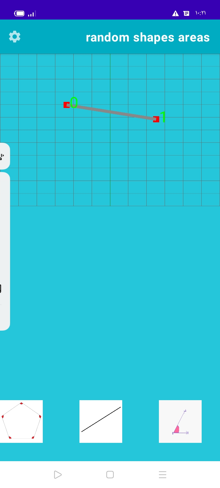
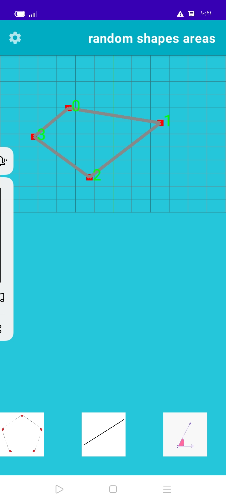
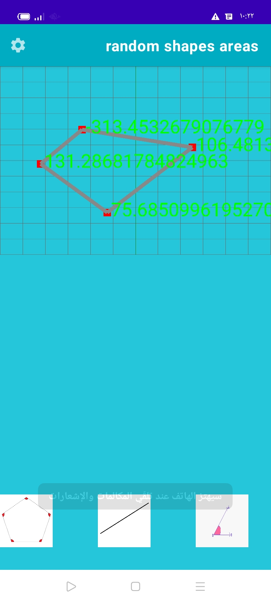
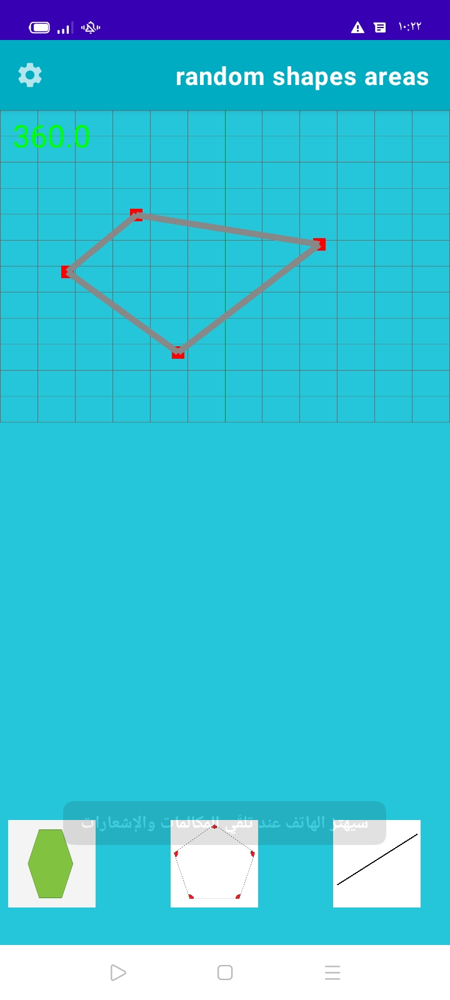
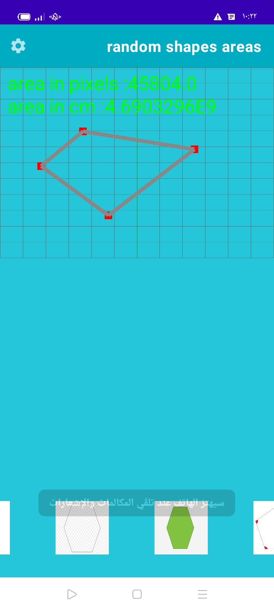
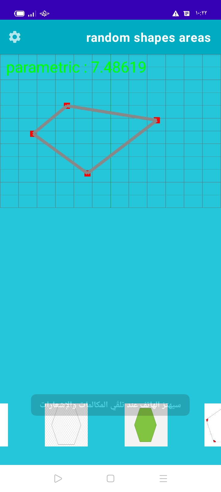
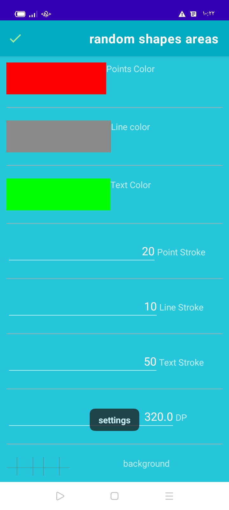
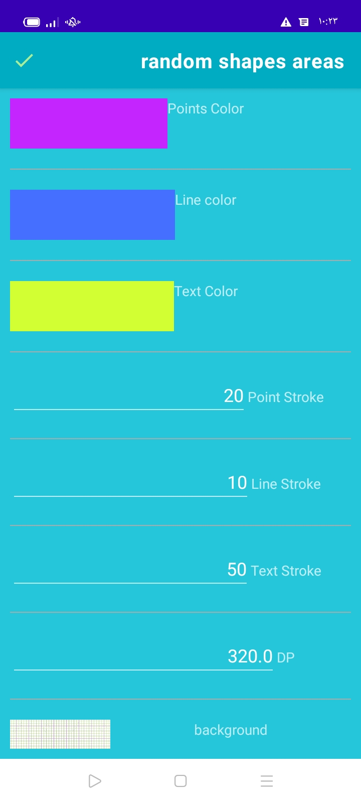
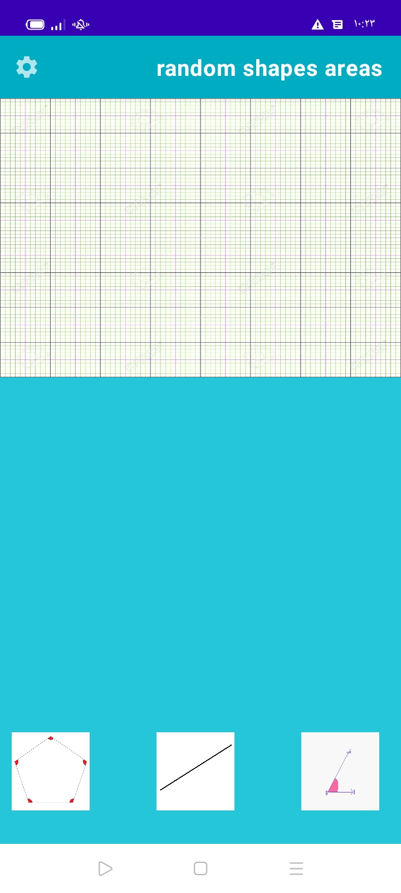
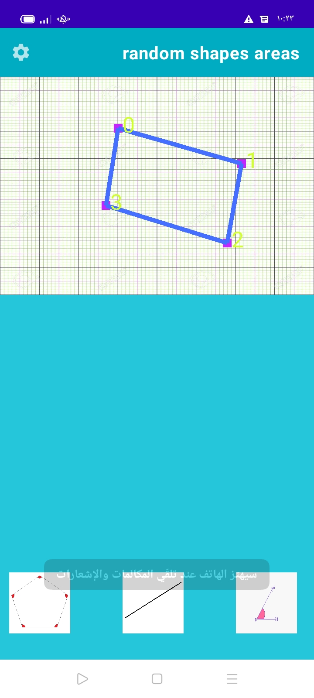

# draw-shape-random-and-get-all-info-area-angels-and-paramitric...etc

* draw an random shape and get area and other math stuff

# you can get angels

# all angels sum if you needed

<h2> area in pixels and cm or meter..etc</h2>

# paramitric

# settings to change

