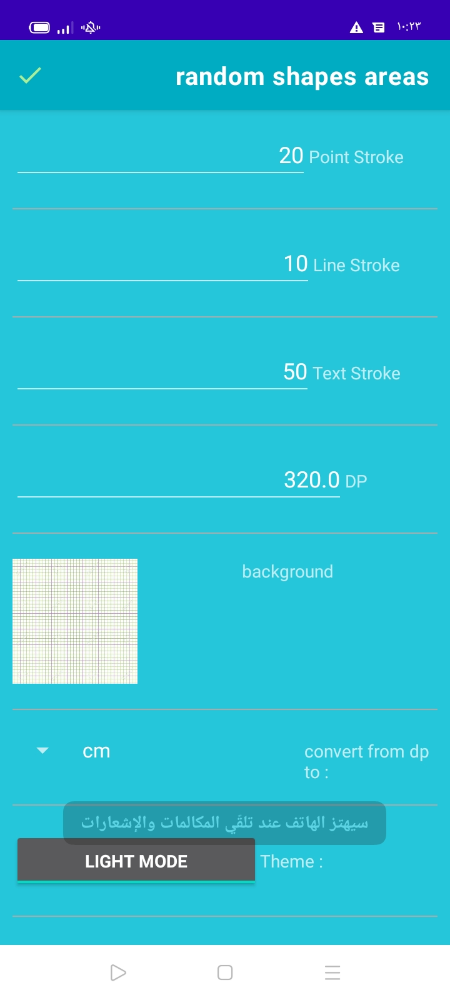

# draw-shape-random-and-get-all-info-area-angels-and-paramitric...etc

## Overview

This project is a tool for drawing various shapes randomly and retrieving detailed information about them, including area, angles, and parametric details. It serves as a practical example for learning about geometry, random shape generation, and information extraction in programming.

## Features

- **Random Shape Generation**: Draws random shapes including triangles, rectangles, and other polygons.
- **Shape Information Extraction**: Provides detailed information such as area, angles, and parameters of the drawn shapes.
- **Interactive UI**: User-friendly interface for generating and interacting with shapes.

## Technologies Used

- JavaScript/TypeScript for shape drawing and interaction
- HTML/CSS for user interface design
- Optional: Any additional libraries or frameworks used in the project

## Usage
1. Generate Random Shapes: Click the button or use the UI element to draw a random shape on the canvas.
2. View Shape Details: Information about the shape's area, angles, and other parameters will be displayed.

Contributing
1. Fork the Repository: Create your own fork of the repository.
2. Create a Branch: Develop new features or fix bugs in a separate branch.
  ```bash
  git checkout -b feature/your-feature
  ```
3. Submit a Pull Request: Once your changes are ready, submit a pull request for review.


## Images for better usage
* draw an random shape and get area and other math stuff


# you can get angels


# all angels sum if you needed


<h2> area in pixels and cm or meter..etc</h2>


# paramitric


# settings to change





